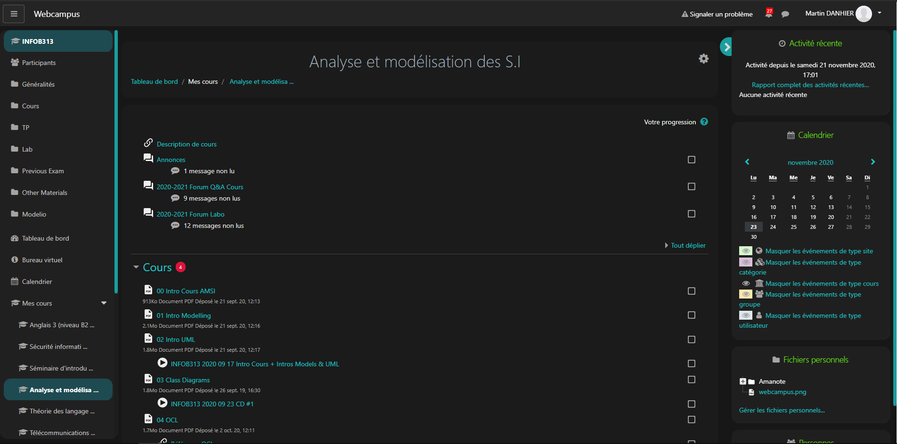

# Modern dark theme for Moodle

## [NEW] V0.6 - Material Design Update + UCLouvain support

## Supported websites and browsers

Currently, only the following websites are officially supported and will be updated:

- [Moodle UCLouvain](https://moodle.uclouvain.be)
- [WebCampus (University of Namur)](https://webcampus.unamur.be/)

However, the theme was designed to be easily extensible to other instances of Moodle. If you want to see it for your university, please open an issue.

Chromium-based browsers and Firefox are supported.

## Installation :

1. Install [Stylus](https://add0n.com/stylus.html) for [Firefox](https://addons.mozilla.org/en-US/firefox/addon/styl-us/), [Chromium](https://chrome.google.com/webstore/detail/stylus/clngdbkpkpeebahjckkjfobafhncgmne).

2. [**Click here to install the CSS Style**](https://raw.githubusercontent.com/martin-danhier/webcampus-dark-theme/master/dark_webcampus.user.css): Stylus recognizes the file, click on `Install Style`.

3. Enjoy

## Contributing

If you notice a problem but don't have time to implement it, you can report it to us in an issue.

If you want to contribute, please fork and make pull requests ! Any help is appreciated.

The proposed changes must be tested against all supported website and browsers before being approved, since Stylus will update the style automatically if a newer version is added to the master branch.

### Explanation of the code and coding guidelines

Whenever possible, we try to respect Material Design V2 guidelines.

The code is structured in *sections*. Each section has a list of URL patterns that Stylus will test against the URL of a visited page. If the URL matches, Stylus will inject the CSS into the page such that it overwrites the default one, thus providing the ability to tweak any website's appearance however we want.

To provide support for multiple instances of Moodle at once, two sections are applied for each website:
- A specific style that is only applied to a specific instance. This is useful if this instance uses a custom CSS.
- A common style that is applied to all instances. This is the main part of the style that is applied on top of Moodle's default style.

The use of SCSS also allows us to define constant variables (for colors or common spacings) and mixins (reusable CSS, for example for a button, elevation or ripple). Use those in priority. Moreover, all used colors should be declared in variables. That way, the colors stay consistent across the whole application, and can be easily tweaked.

Some variables, like the primary and secondary colors, are defined with vanilla CSS variables instead. Unlike SCSS variables, they keep their variable form in the compiled code, which means that different color themes can be defined for different websites. These themes are defined in the [themes](src/themes) directory.

Feel free to ask questions if you have any !
