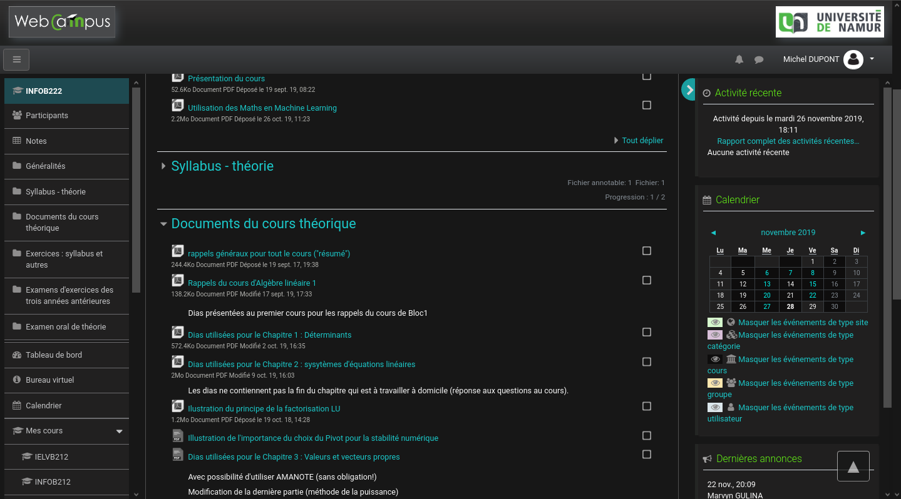
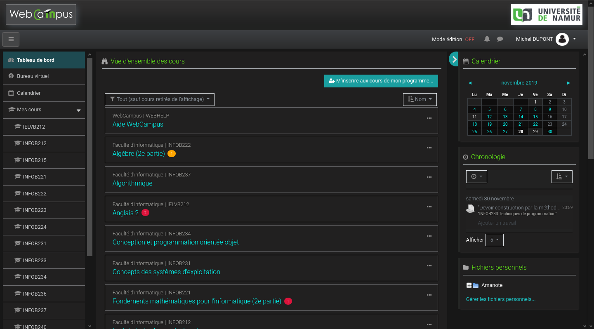

# Webcampus Dark Theme

## Aperçu

## Installation :

1. Installer [Stylus](https://add0n.com/stylus.html) pour [Firefox](https://addons.mozilla.org/en-US/firefox/addon/styl-us/), [Chromium](https://chrome.google.com/webstore/detail/stylus/clngdbkpkpeebahjckkjfobafhncgmne).

2. [Cliquez ici pour installer le CSS](https://raw.githubusercontent.com/martin-danhier/webcampus-dark-mode/master/dark_webcampus.user.css): Stylus reconnaît le fichier, cliquer sur `Install Style`.

3. Enjoy
