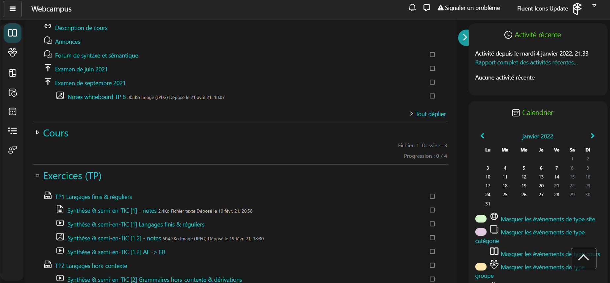

# Webcampus Dark Theme

Voir la page [Userstyles](https://userstyles.world/style/3158/webcampus-dark-theme).

## [NEW] Fluent Icons Update 0.5.24

## Aperçu

## Installation :

1. Installer [Stylus](https://add0n.com/stylus.html) pour [Firefox](https://addons.mozilla.org/en-US/firefox/addon/styl-us/), [Chromium](https://chrome.google.com/webstore/detail/stylus/clngdbkpkpeebahjckkjfobafhncgmne).

2. [Cliquez ici pour installer le CSS](https://userstyles.world/api/style/3158.user.css): Stylus reconnaît le fichier, cliquer sur `Install Style`.

3. Enjoy

## Contributions

Vous pouvez faire un fork et ouvrir des pull requests si vous avez des idées d'améliorations.
